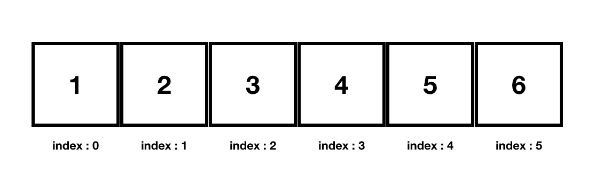
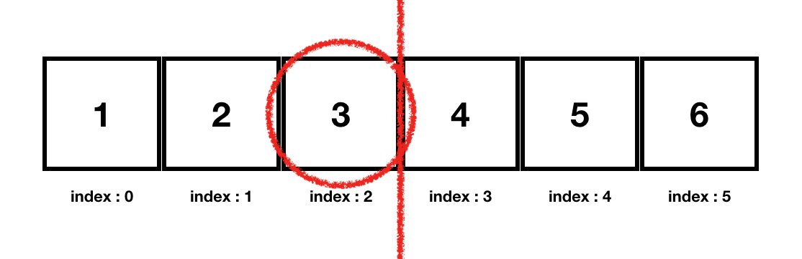
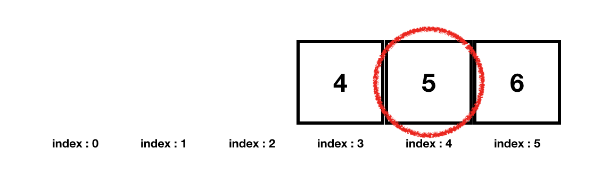

<h1>Java 이진탐색 구현하기</h1>


<p>처음 입사하자마자 이진탐색을 구현해오라는 과제를 받았다. </p>
<p>구현은 둘째치고 이진탐색을 정보처리기사 공부할 때 잠깐 읽어본 것 외에는 알지못했기에 대혼돈에 빠졌다......</p>

<p>그래서 이포스트에서는 ArrayList로 이진탐색을 구현하는 법을 얘기하고자 한다.</p>
<p>구현해야 하는 것은 두가지였다.</p>

<ul>
<li>이진탐색을 이용하여 오름차순, 내림차순 정렬로 값을 insert하는 함수 만들기</li>
<li>이진참색을 이용하여 값을 찾는 함수 만들기</li>
</ul>


<p>첫번째 함수보다 두번째 함수가 구현하기 더 간단하다. 우선 이진탐색에서 값을 찾는 함수를 만드려면 값을 찾으려는 대상이 
<strong>오름차순, 혹은 내림차순으로 정렬되어있다는 조건</strong>이 필요하다. </p>

<p>값을 찾는 방법을 그림으로 설명하자면 우선 이와 같은 배열이 있다고 생각해보도록 하자.</p>
<p>오름차순으로 정렬되있는 size 6의 배열이 있다. 여기서 5의 index 값을 찾는 것이다. </p>



<p>우선 이 배열을 반으로 나눈 뒤 그 index에 들어있는 값을 가져온다</p>
<p>이 배열에서 총 index는 5이므로 5/2 = 2.5 (소수점 이하 값은 버린다)</p>
<p>즉, <strong>index 2</strong> 에 들어 있는 값을 가져온다.</p>




<p>index 2에 들어잇는 값은 <strong>3</strong>이다. 이 값을 찾으려는 값 5와 비교한다.</p>
<p>찾으려는 값 5보다 index 2의 값이 더 작으므로 반으로 자른 배열에서 왼쪽에 해당하는 배열은 더이상 찾지 않는다.</p>
<p>마치 up down 게임 처럼 찾으려는 값보다 가져온 값이 더작으면 up으로 찾고, 작으면 down으로 찾는다.</p>

<p>왼쪽을 제외한 배열에서 또 다시 반으로 index를 잘라 비교한다.</p>
<p>이를 코드로 구현하기 위해서 <strong>배열의 처음 index를 이 전에 반으로 자른 index에 1을 더해 계산</strong>한다.</p>
<p>3(2:이전에서 반으로 나눈 index 값 + 1)과 배열의 맨 끝 index 5를 더해 반으로 나눈다.</p>
<p>그러면 8/2 = 4 index 4의 값을 가져와 비교하게 된다.</p>



<p>index 4의 값은 우리가 찾으려던 값인 5이므로 이 함수가 끝나게 된다.</p>


```java
public int findBinarySearchData(boolean asc, ArrayList<Integer> alNumber, int number) {
		int result = -1;
		int sourcekey = -1, targetkey = -1;
		sourcekey = number;

		boolean bFound = false;
		int low = 0;
		int high = alNumber.size() - 1;
		int mid = -1;

		// binary search
		while (low <= high) {
			mid = (low + high) / 2;
			targetkey = alNumber.get(mid);
				// ascending
				if(asc) {
					if(sourcekey == targetkey) {
						bFound = true;
						break;
					}
					else if(targetkey > sourcekey) {
						high = mid - 1;
					}
					else {
						low = mid + 1;
					}
				}
				// descending
				else {
					if(sourcekey == targetkey) {
						bFound = true;
						break;
					}
					else if(targetkey < sourcekey) {
						high = mid - 1;
					}
					else {
						low = mid + 1;
					}
				}
			}
	
			if(bFound) {
				result = mid;
			}
	
			return result;
		}
```
