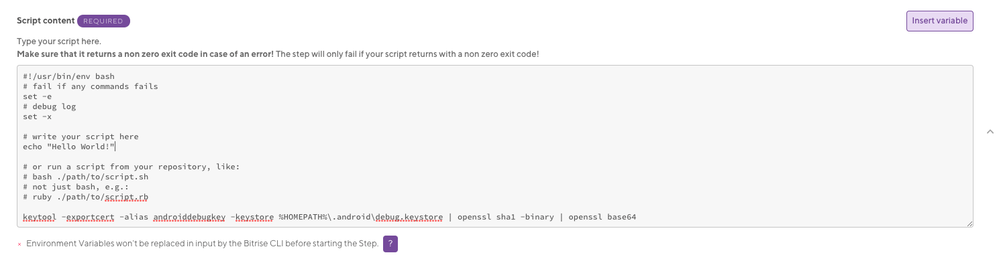

# Bitrise 회원 가입 및 앱 생성 

[Bitrise 홈페이지](https://app.bitrise.io/) 에 접속해서 회원가입을 진행한다.

Add your first app을 눌러 앱 생성을 시작한다.

App을 Private으로 할것인지 Public으로 할것인지 선택한 후 git repository를 선택한다.

Github, bitbucket, GitLab 그리고 URL로 연결할 수 있다.


Github repository를 선택하면 access key를 생성할 것인지 물어본다.

auoto add SSH key 를 선택하면 알아서 key를 만들어 연결해준다.


이제 branch를 선택한다.
bit


Branch를 선택하면 그 branch에 commit이 일어날 때 마다 앱을 자동으로 빌드한다.

그러므로 너무 자주 빌드를 하지 않고 싶으면 전용 branch를 따서 merge하는 것을 추천한다.

Branch를 선택하고 나면 Bitrise가 repository에 접근할 수 있는지 체크한다. 

여기까지 하면 반은 완성된다!!! 🎉


# WorkFlow 편집하기

WorkFlow는 말그대로 앱을 빌드할때 어떤 것들을 실행할 지 정의할 수 있다.

Test apk를 매번 빌드하는것이 귀찮아서 Bitrise를 사용하는 거니까, app을 빌드하고 마지막에 그 결과를 slack으로 보내게 workflow를 편집하였다.


### 1. Gradle Runner

APK를 만드려면 Gradle Runner를 workflow에 추가해야 한다.

왼쪽 화면에서 workflow를 추가하고자 하는 곳에 +버튼을 누르면 검색창이 나온다. 창에서 Gradle을 검색해서 Gradle Runner를 추가한다.


Gradle로 앱을 빌드하려면 repository이 세가지가 꼭 있어야한다.

1. gradle.properties
2. gradlew
3. Gradle/wrapper 폴더

이 폴더가 존재해야 앱을 빌드할 수 있다.(이거 몰라서 한참 헤멨음..)

다시 Gradle Runner로 넘어와서 Input variables에 task와 file path를 선언해줘야한다. 기본으로 설정된 값이 있는데 이거대로 해도 원래 돌아가야하는데 내 경우에 gralew 파일을 찾지 못해 build fail이 나서 직접 설정했다.

Gradle task는 빌드하고자하는 apk의 타입에 따라 선언하고, gralew file path는 repository에서 gralew 파일이 있는 경로를 선언해줘야한다.

Debug apk를 빌드할 것이고, gralew 파일은 최상단에 위치해있어서 이렇게 선언해주었다.

**Gradle task to run : assembleDebug**

**Gralew file path : $PROJECT_LOCATION/gradlew**


### 2. Script for SNS login

그리고 혹시 App이 Kakao login이나 Facebook login을 사용한다면 hash key를 구하지 않으면 로그인이 되지않는다 ...

Hash key를 구하기 위해 grale runner flow 밑에 Script를 추가한다. 


Scrpit를 선택하면 Script content를 설정할 수 있는데 여기에 hash key를 구하는 scipt를 추가해주면 된다.

```shell
keytool -exportcert -alias androiddebugkey -keystore %HOMEPATH%\.android\debug.keystore | openssl sha1 -binary | openssl base64
```




### 3. Slack 메시지 보내기

마지막으로 앱이 빌드가 완료되면 APK path와 빌드 fail/success 메시지를 보낼 수 있다.

마지막에 +를 눌러 slack을 검색하고 Send a Slack message를 추가한다.

Slack과 Bitrise을 연동하는 과정은 [이 글]([https://velog.io/@ironelder/Bitrise-%EC%9E%90%EB%8F%99-%EB%B9%8C%EB%93%9C-%ED%9B%84-Slack%EB%A9%94%EC%8B%9C%EC%A7%80-%EC%97%B0%EB%8F%99%ED%95%98%EA%B8%B0-nmk6ag26mp](https://velog.io/@ironelder/Bitrise-자동-빌드-후-Slack메시지-연동하기-nmk6ag26mp)) 을 참고하여 진행하면 된다.

Traget slaack channel, group or username에서 

#<channel이름>$BITRISE_BUILD_STATUS$BITRISE_APK_PATH_LIST

이렇게 설정해주면 다음과 같이 메시지가 온다.


Install Page를 클릭하면 아래와 같은 페이지로 이동해서 APK를 다운로드 받을 수 있다.


