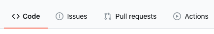
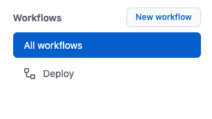
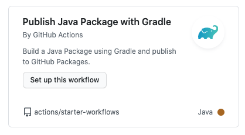
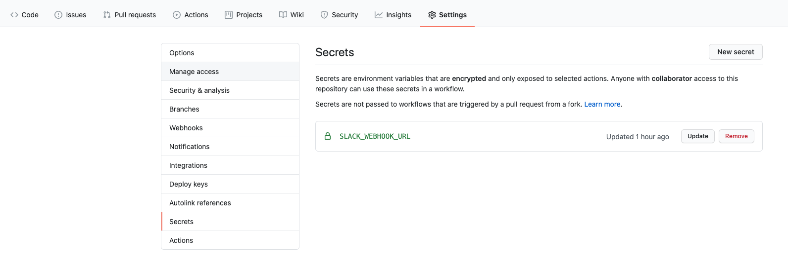

[Bitriste로 APK 자동 배포하기](https://coooldoggy.github.io/bitrise%EB%A1%9C-apk-%EC%9E%90%EB%8F%99-%EB%B0%B0%ED%8F%AC%ED%95%98%EA%B8%B0) 에 이어서 Github의 신기능 Github Action으로 안드로이드 APK를 자동빌드하는 것을 만들어 보았다.  

Github Action은 사용량에 따라 과금되는데 개인이 사용하는 정도는 무료라고 보면 된다 ,,,

YAML 스크립트로 작성해서 만드는 건데 Bitrise는 workflow가 좀더 유저친화적이고 이해하기 쉬웠다면 코드로만 이루어진 Github Action은 어렵게 느껴질 수 있다. 하지만, Guide에서 하라는 대로 하면 아주 잘된다.. 그리고 사람들이 만들어둔 다양한 tool을 MarketPlace에서 가져다 연동할 수 있다. 


## Github Action

https://github.com/features/actions

https://docs.github.com/en/free-pro-team@latest/actions

- 소프트웨어 workflow를 자동화할 수 있도록 도와주는 도구
- github Repository에 들어오는 이벤트를 Trigger로 사용 가능 
- github marketplace에 있는 여러 기능들 사용 가능 
- 500MB, 2000분/월 무료 


## Github Action으로 APK 빌드, Slack 메시지 전송하기

### Github repository에서 Actions tab 선택 



### New Workflow 생성 



### Publish Java Package with Gradle로 workflow 시작 



### Workflow 이름, Trigger 설정 

##### Trigger option

  - on: [push, pull_request]  

  -  branches (branch 이름)
  

    

```yaml
on:
  # Trigger the workflow on push or pull request,
  # but only for the main branch
  push:
    branches:
      - main
  pull_request:
    branches:
      - main
```


master에 push되었을 때 workflow 실행 

```yaml
name: Deploy
 
on:
 
  push:
 
    branches: master
```


### Java 설치

```yaml
- name: Set up JDK 1.8
     uses: actions/setup-java@v1
     with:
       java-version: 1.8
       server-id: github # Value of the distributionManagement/repository/id field of the pom.xml
       settings-path: ${{ github.workspace }} # location for the settings.xml file
```


### 현재 날짜 구하기

```yaml
- name: Get current date
     id: date
     run: echo "::set-output name=date::$(date +'%Y-%m-%d')"
```


### APK 생성 

```yaml
- name: Build APK
     run: bash ./gradlew assembleRelease --stacktrace
```


### APK Upload

https://github.com/marketplace/actions/upload-a-build-artifact 사용 

```yaml
 - name: Upload APK
   uses: actions/upload-artifact@v2
   with:
     name: app_${{ steps.date.outputs.date }}
     path: app/release/app-release.apk
```


### Slack Message 전송 

https://github.com/marketplace/actions/action-slack 사용 

```yaml
- name: action-slack
     uses: 8398a7/action-slack@v3.8.0
     with:
       status: ${{job.status}}
       author_name: 빌드 알림
     env:
       SLACK_WEBHOOK_URL: ${{ secrets.SLACK_WEBHOOK_URL }} # required
```


```
SLACK_WEBHOOK_URL 은 Secret에 등록해야함 
```

Github Repository > Settings > Secrets에 등록 




### Full code

```
# This workflow will build a package using Gradle and then publish it to GitHub packages when a release is created
 
# For more information see: https://github.com/actions/setup-java#publishing-using-gradle
 
 
 
 
name: Deploy
 
on:
 
  push:
 
    branches: master
 
jobs:
 
  build:
 
    runs-on: ubuntu-latest
 
 
 
 
    steps:
 
    - uses: actions/checkout@v2
 
    - name: Set up JDK 1.8
 
      uses: actions/setup-java@v1
 
      with:
 
        java-version: 1.8
 
        server-id: github # Value of the distributionManagement/repository/id field of the pom.xml
 
        settings-path: ${{ github.workspace }} # location for the settings.xml file
 
     
 
#     - name: Build with Gradle
#       run: ./gradlew build
 
       
#Debug용 Key Hash
#    - name: get Key Hash
 
#      run: keytool -exportcert -alias androiddebugkey -keystore %HOMEPATH%\.android\debug.keystore | openssl sha1 -binary | openssl base64
 
     
 
    - name: Get current date
      id: date
      run: echo "::set-output name=date::$(date +'%Y-%m-%d')"
 
       
 
    - name: Build APK
      run: bash ./gradlew assembleRelease --stacktrace
 
       
 
    - name: Upload APK
      uses: actions/upload-artifact@v2
      with:
        name: app_${{ steps.date.outputs.date }}
        path: app/release/app-release.apk
 
         
 
    - name: action-slack
      uses: 8398a7/action-slack@v3.8.0
      with:
        status: ${{job.status}}
        author_name: 빌드 알림
      env:
        SLACK_WEBHOOK_URL: ${{ secrets.SLACK_WEBHOOK_URL }} # required
```
