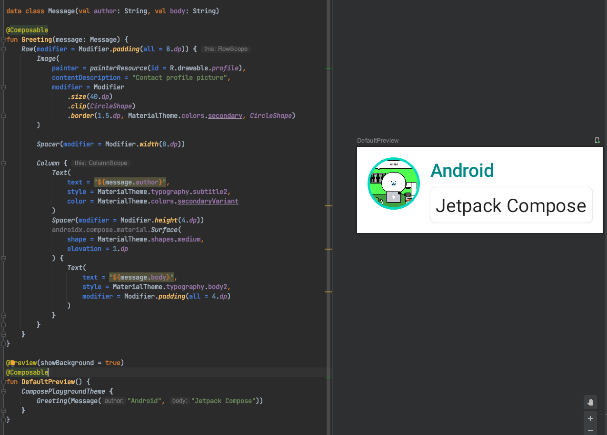

## Jetpack Compse 

[Thinking in Compose](https://developer.android.com/jetpack/compose/mental-model?continue=https%3A%2F%2Fdeveloper.android.com%2Fcourses%2Fpathways%2Fcompose%23article-https%3A%2F%2Fdeveloper.android.com%2Fjetpack%2Fcompose%2Fmental-model)
- Android를 위한 선언형 UI Toolkit 
- xml이 아닌 kotlin 으로 작성되기 때문에 kotlin 코드 처럼 dynamic 해질 수 있다. 


## Jetpack Compose Tutorial 

[Tutorial](https://developer.android.com/jetpack/compose/tutorial?continue=https%3A%2F%2Fdeveloper.android.com%2Fcourses%2Fpathways%2Fcompose%23article-https%3A%2F%2Fdeveloper.android.com%2Fjetpack%2Fcompose%2Ftutorial0)

#### @Composable
- function/lamda에 사용할 수 있다. 
- UI를 구성하는 함수에 어노테이션 추가 


#### @Preview
- Preview 할 함수에 어노테이션사용 
- @Composable 어노테이션이 붙어있는 method에서 사용가능 
- Params 
    - name: 패널에 표시되는 Preview 이름 
    - group: Preview의 그룹이름. Preview를 그룹핑하고 그룹에 속한 프리뷰를 여러개 보여줄 수 있음
    - apiLevel: 렌더링되는 API 레벨 
    - widthDp: 최대 넓이 DP, viewport의 렌더링 사이즈를 제한하기 위해 사용됨 
    - heightDp: 최대 높이 DP, viewport의 렌더링 사이즈를 제한하기 위해 사용됨 
    - locale: 현재 사용자의 locale
    - fontScale: 사용자 기본 설정
    - showSystemUi: True로 설정하면 상태바, 액션 바와 같이 기기에서 사용하는 화면이 표시됨 
    - showBackground: True로 설정하면 기본 배경화면 색상 적용 
    - uiMode: android.content.res.Configuartion.uiMode
    - device: Preview에 사용할 device 지정 




#### Text 

- TextView 
- Params
    - text : 보여줄 text
    - modifier: Layout node에 적용되는 modifier
    - color: Text에 적용되는 색상, 명시되지 않으면 LocalContentColor로 적용됨
    - fontSize: Text의 사이즈
    - fontStyle: 적용될 typeface
    - fontWeight: 폰트 굵기 적용값, ex) FontWeight.Bold,,,
    - letterSpacing: 자간 간격
    - textDecoration: 밑줄과 같은 텍스트 데코레이션 값
    - textAlign: 텍스트의 정렬
    - lineHeight: 문단의 높이 
    - overflow: overflow가 되었을때 어떻게 다뤄질지에 대한 설정 
    - softWrap: text가 줄바꿈을 수행해야하는지에 대한 것, false로 설정된 경우 가로로 무한한 공간을 차지함. softWrap값이 false이면 overflow와 textAlign이 기대하는 것과 다른 동작을 할 수 있음.
    - maxLines: text가 가지는 최대 줄수 제한 
    - style: Text의 color, font, lineHeight와 같은 스타일 값 


```kotlin
@Composable
fun Text(
    text: String,
    modifier: Modifier = Modifier,
    color: Color = Color.Unspecified,
    fontSize: TextUnit = TextUnit.Unspecified,
    fontStyle: FontStyle? = null,
    fontWeight: FontWeight? = null,
    fontFamily: FontFamily? = null,
    letterSpacing: TextUnit = TextUnit.Unspecified,
    textDecoration: TextDecoration? = null,
    textAlign: TextAlign? = null,
    lineHeight: TextUnit = TextUnit.Unspecified,
    overflow: TextOverflow = TextOverflow.Clip,
    softWrap: Boolean = true,
    maxLines: Int = Int.MAX_VALUE,
    onTextLayout: (TextLayoutResult) -> Unit = {},
    style: TextStyle = LocalTextStyle.current
) {
    Text(
        AnnotatedString(text),
        modifier,
        color,
        fontSize,
        fontStyle,
        fontWeight,
        fontFamily,
        letterSpacing,
        textDecoration,
        textAlign,
        lineHeight,
        overflow,
        softWrap,
        maxLines,
        emptyMap(),
        onTextLayout,
        style
    )
}
```

##### Usage 

```kotlin
 Text(
                    text = "${message.body}",
                    style = MaterialTheme.typography.body2,
                    modifier = Modifier.padding(all = 4.dp),
                    color = MaterialTheme.colors.secondaryVariant
                )
```


#### Colum
- view를 수직으로 정렬할때 사용 

```kotlin
@Composable
inline fun Column(
    modifier: Modifier = Modifier,
    verticalArrangement: Arrangement.Vertical = Arrangement.Top,
    horizontalAlignment: Alignment.Horizontal = Alignment.Start,
    content: @Composable ColumnScope.() -> Unit
) {
    val measurePolicy = columnMeasurePolicy(verticalArrangement, horizontalAlignment)
    Layout(
        content = { ColumnScopeInstance.content() },
        measurePolicy = measurePolicy,
        modifier = modifier
    )
}
```

##### Usage

```kotlin
@Composable
fun MessageCard(msg: Message) {
    Column {
        Text(text = msg.author)
        Text(text = msg.body)
    }
}
```

#### Row
- view를 수평으로 정렬할 때 사용 

```kotlin
@Composable
inline fun Row(
    modifier: Modifier = Modifier,
    horizontalArrangement: Arrangement.Horizontal = Arrangement.Start,
    verticalAlignment: Alignment.Vertical = Alignment.Top,
    content: @Composable RowScope.() -> Unit
) {
    val measurePolicy = rowMeasurePolicy(horizontalArrangement, verticalAlignment)
    Layout(
        content = { RowScopeInstance.content() },
        measurePolicy = measurePolicy,
        modifier = modifier
    )
}
```

#### Modifier
- Compose UI 요소들을 꾸미고, behavior를 지정함.
- 예를 들면 배경, 패딩, 클릭 이벤트 리스너 등등 