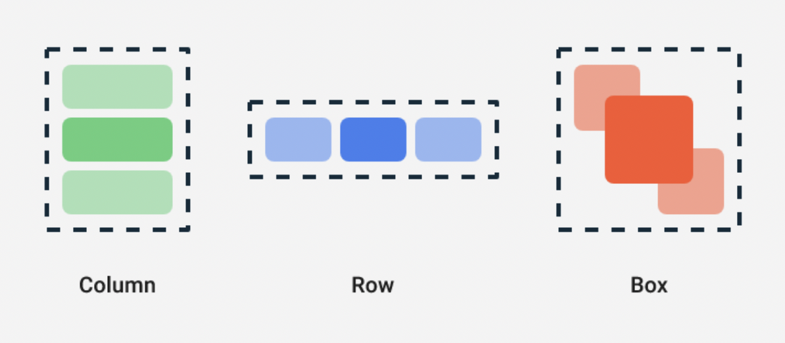

## Jetpack Compse 

[Thinking in Compose](https://developer.android.com/jetpack/compose/mental-model?continue=https%3A%2F%2Fdeveloper.android.com%2Fcourses%2Fpathways%2Fcompose%23article-https%3A%2F%2Fdeveloper.android.com%2Fjetpack%2Fcompose%2Fmental-model)
- Android를 위한 선언형 UI Toolkit 
- xml이 아닌 kotlin 으로 작성되기 때문에 kotlin 코드 처럼 dynamic 해질 수 있다. 
- @Composable 함수는 코틀린으로 작성된 다른 함수들 같이 사용될 수 있다. 
- XML이 특정 상태에 따라 UI가 어떻게 보여질지에 관한 것이였다면, Compose는 특정 상태에 따라 UI가 무엇을 보여주는지에 대한 구현이다. 

```kotlin
@Composable
fun MyApp(names: List<String> = listOf("World", "Compose")) {
    Column {
        for (name in names) {
            Greeting(name = name)
        }
    }
}
```


## Compose 에서 기억해야할 것
- Composable 함수는 순서와 관계없이 실행될 수 있다.
- Composable 함수는 동시에 실행할 수 있다. 
    - Compose가 멀티코어를 활용하고, 화면에 없는 기능을 낮은 우선순위로 실행할 수 있다. 
- Recomposition이 일어날때 특정 Composable 함수와 람다 함수들을 건너뛸 수 있다.
- Recomposition은 상태에 따라 취소되고, 다시 시작할 수 있다.
- Child mesaure는 한번만 할 수 있다. 두번하면 runtime Exception 발생 


## State 관리하기 !!!!!

[State Documents](https://developer.android.com/jetpack/compose/state)

Compose는 선언형이기 때문에 값을 바꾸기 위해서는 Compose함수에 다른 값을 전달하는 방법 뿐이다. 보통 이 값을 UI State라고 한다. 
State가 업데이트 될 때 마다, recompositon이 수행된다. TextField같은 위젯은 xml과 달리 스스로 값을 업데이트하지 않는다.
Composable은 명시적으로 state가 바뀌었음을 알려줘야 업데이트가 일어난다. 

Composable 에서는 **remember**라는 것을 이용해서 상태 값을 관리할 수 있다. 
remember는 mutable 또는 immutable 객체로 사용가능하다. 

```kotlin
val mutableState = remember { mutableStateOf(default) }
```


## Stateful vs Stateless 

Flutter에서 사용되는 StatefulWidget과 StatelessWidget과 유사한 개념이다. 
상태가 있는 곳에서는 값을 바꾸거나 상태를 기억할 수 있고, 상태가 존재하지 않는 곳에서는 값을 바꾸거나 상태를 기억하지 못한다. 


Compose에서 remeber로 상태를 관리하고, 기억하는 것은 Stateful, 즉 상태를 가지는 위젯이다. 
Stateless 위젯은 어떠한 상태도 가지지 않는 위젯을 뜻한다. 

## Jetpack Compose Tutorial & 구성요소들 

[Tutorial](https://developer.android.com/jetpack/compose/tutorial?continue=https%3A%2F%2Fdeveloper.android.com%2Fcourses%2Fpathways%2Fcompose%23article-https%3A%2F%2Fdeveloper.android.com%2Fjetpack%2Fcompose%2Ftutorial0)

#### @Composable
- function/lamda에 사용할 수 있다. 
- UI를 구성하는 함수에 어노테이션 추가 


#### @Preview
- Preview 할 함수에 어노테이션사용 
- @Composable 어노테이션이 붙어있는 method에서 사용가능 
- Params 
    - name: 패널에 표시되는 Preview 이름 
    - group: Preview의 그룹이름. Preview를 그룹핑하고 그룹에 속한 프리뷰를 여러개 보여줄 수 있음
    - apiLevel: 렌더링되는 API 레벨 
    - widthDp: 최대 넓이 DP, viewport의 렌더링 사이즈를 제한하기 위해 사용됨 
    - heightDp: 최대 높이 DP, viewport의 렌더링 사이즈를 제한하기 위해 사용됨 
    - locale: 현재 사용자의 locale
    - fontScale: 사용자 기본 설정
    - showSystemUi: True로 설정하면 상태바, 액션 바와 같이 기기에서 사용하는 화면이 표시됨 
    - showBackground: True로 설정하면 기본 배경화면 색상 적용 
    - uiMode: android.content.res.Configuartion.uiMode
    - device: Preview에 사용할 device 지정 


#### Text 

- TextView 
- Params
    - text : 보여줄 text
    - modifier: Layout node에 적용되는 modifier
    - color: Text에 적용되는 색상, 명시되지 않으면 LocalContentColor로 적용됨
    - fontSize: Text의 사이즈
    - fontStyle: 적용될 typeface
    - fontWeight: 폰트 굵기 적용값, ex) FontWeight.Bold,,,
    - letterSpacing: 자간 간격
    - textDecoration: 밑줄과 같은 텍스트 데코레이션 값
    - textAlign: 텍스트의 정렬
    - lineHeight: 문단의 높이 
    - overflow: overflow가 되었을때 어떻게 다뤄질지에 대한 설정 
    - softWrap: text가 줄바꿈을 수행해야하는지에 대한 것, false로 설정된 경우 가로로 무한한 공간을 차지함. softWrap값이 false이면 overflow와 textAlign이 기대하는 것과 다른 동작을 할 수 있음.
    - maxLines: text가 가지는 최대 줄수 제한 
    - style: Text의 color, font, lineHeight와 같은 스타일 값 


```kotlin
@Composable
fun Text(
    text: String,
    modifier: Modifier = Modifier,
    color: Color = Color.Unspecified,
    fontSize: TextUnit = TextUnit.Unspecified,
    fontStyle: FontStyle? = null,
    fontWeight: FontWeight? = null,
    fontFamily: FontFamily? = null,
    letterSpacing: TextUnit = TextUnit.Unspecified,
    textDecoration: TextDecoration? = null,
    textAlign: TextAlign? = null,
    lineHeight: TextUnit = TextUnit.Unspecified,
    overflow: TextOverflow = TextOverflow.Clip,
    softWrap: Boolean = true,
    maxLines: Int = Int.MAX_VALUE,
    onTextLayout: (TextLayoutResult) -> Unit = {},
    style: TextStyle = LocalTextStyle.current
) {
    Text(
        AnnotatedString(text),
        modifier,
        color,
        fontSize,
        fontStyle,
        fontWeight,
        fontFamily,
        letterSpacing,
        textDecoration,
        textAlign,
        lineHeight,
        overflow,
        softWrap,
        maxLines,
        emptyMap(),
        onTextLayout,
        style
    )
}
```

##### Usage 

```kotlin
 Text(
                    text = "${message.body}",
                    style = MaterialTheme.typography.body2,
                    modifier = Modifier.padding(all = 4.dp),
                    color = MaterialTheme.colors.secondaryVariant
                )
```


### Layout

- Jetpack Compose 에는 세개의 기본 레이아웃 정렬이 있다. 
    - Colum
    - Row
    - Box 



#### Colum
- view를 수직으로 정렬할때 사용된다. 

```kotlin
@Composable
inline fun Column(
    modifier: Modifier = Modifier,
    verticalArrangement: Arrangement.Vertical = Arrangement.Top,
    horizontalAlignment: Alignment.Horizontal = Alignment.Start,
    content: @Composable ColumnScope.() -> Unit
) {
    val measurePolicy = columnMeasurePolicy(verticalArrangement, horizontalAlignment)
    Layout(
        content = { ColumnScopeInstance.content() },
        measurePolicy = measurePolicy,
        modifier = modifier
    )
}
```

- LazyColum을  사용하면 list를 만들 수 있다. 
- LazyColum은 안드로이드의 Recyclerview와 같다.

```kotlin
@Composable
fun LazyList() {
    // We save the scrolling position with this state that can also 
    // be used to programmatically scroll the list
    val scrollState = rememberLazyListState()

    LazyColumn(state = scrollState) {
        items(100) {
            Text("Item #$it")
        }
    }
}
```

##### Usage

```kotlin
@Composable
fun MessageCard(msg: Message) {
    Column {
        Text(text = msg.author)
        Text(text = msg.body)
    }
}
```

#### Row
- view를 수평으로 정렬할 때 사용 

```kotlin
@Composable
inline fun Row(
    modifier: Modifier = Modifier,
    horizontalArrangement: Arrangement.Horizontal = Arrangement.Start,
    verticalAlignment: Alignment.Vertical = Alignment.Top,
    content: @Composable RowScope.() -> Unit
) {
    val measurePolicy = rowMeasurePolicy(horizontalArrangement, verticalAlignment)
    Layout(
        content = { RowScopeInstance.content() },
        measurePolicy = measurePolicy,
        modifier = modifier
    )
}
```

#### Modifier

[Modifier Documents](https://developer.android.com/reference/kotlin/androidx/compose/ui/Modifier)

- Compose UI 요소들을 꾸미고, behavior를 지정함.
- 예를 들면 배경, 패딩, 클릭 이벤트 리스너 등등 


#### Button
- Button


#### Customizing Layout 

- Modifier.layout 사용시 measurable, constraints 두개의 파라미터가 주어진다.
- measurable: 자식이 위치하고 크기가 정해질것 
- constraints: 자식의 최소, 최대 넓이와 높이

```
fun Modifier.customLayoutModifier(...) = Modifier.layout { measurable, constraints ->
  ...
})
```

#### Constraint Layout 

dependency 추가 

```
// build.gradle
implementation "androidx.constraintlayout:constraintlayout-compose:1.0.0-alpha07"
```

- Reference는 createRefs() 를 호출하여 만들어진다. 
- constraint로 참조할 compose에 createRefs()를 호출하여야 reference로 사용가능 
- constrainAs 사용하여 constraint 추가 
- linkTo 와 같은 함수로 constraint 설정 

```kotlin
@Composable
fun ConstraintLayoutContent() {
    ConstraintLayout {

        // Create references for the composables to constrain
        val (button, text) = createRefs()

        Button(
            onClick = { /* Do something */ },
            // Assign reference "button" to the Button composable
            // and constrain it to the top of the ConstraintLayout
            modifier = Modifier.constrainAs(button) {
                top.linkTo(parent.top, margin = 16.dp)
            }
        ) {
            Text("Button")
        }

        // Assign reference "text" to the Text composable
        // and constrain it to the bottom of the Button composable
        Text("Text", Modifier.constrainAs(text) {
            top.linkTo(button.bottom, margin = 16.dp)
        })
    }
}
```

- ConstraintLayout에서 사용하는 guildLine, barrier, chain 등을 사용할 수 있다. 
- barrier는 ConstraintLayout안에서 생성될 수 있다. constrainAs안에서는 생성 불가 

```kotlin
val barrier = createEndBarrier(button1, text)
```