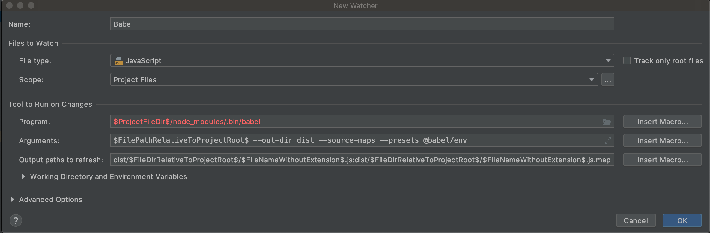

# ES6

강의에서 친절하게 설명안해줘서 ..설명은 [이 글](http://velog.io/@godori/ES6-정리-vpjmrh6hhe) 을 참조하였다.

[MDN web doc](https://developer.mozilla.org/ko/) 에서도 자세한 설명들이 많음.


<h2><a href="https://babeljs.io/docs/en/">Bable</a> 이란?</h2>
바벨은 다음버전의 자바스크립트 문법을 현재 사용가능한 문법으로 변환시켜주는 역할을 한다.
ES6는 또뭐냐 ..??
ECMAScript 란 자바스크립트를 이루는 코어 스크립트 언어이다. 이것을 ES라고 줄여 부르고 6는 버전명이다.


## Babel 로컬 환경설정

##### 1.  Babel-cli 와 babel-node 설치(web storm)

```
npm install --save-dev babel-cli
```

+ 설치후 webstrom 실행 

Preference > Tool > File Watcher 에 이동

"+" 버튼을 누르고 Babel 추가



+ .babelrc config 파일 생성 

```
npm install @babel/preset-env --save-dev
```

webstorm 이외의 방법은 [Babel install 홈페이지](https://babeljs.io/setup#installation)에 자세히 나와있다.


##### 2. npx 설치

script 를 안만들어도 실행시켜주는 역할을 함.

```
npm install -g npx
```


## String literal

const 와 let가 있다.

Swift 에서는 let 가 상수인데 ES6에서는 let가 변수이다.

const 를 기본으로 사용하고, const는 값의 재할당이 불가능하다.

문자열 더하기는 + 또는 ${}로 표현가능. conVal 과 litVal은 출력값이 같다.

```javascript
const val1 = 'string1';
const val2 = 'string2';

const conVal = val1 + ',' + val2;
const litVal = `${val1}, ${val2}`
```


## let, const

기존의 javascript 에는 var만 존재했음.

Const : 값의 재할당이 불가능함. 객체 안의 변수는 재할당이 가능한데 그 자체를 바꾸는 것은 불가능.

hoisting : scope 가 다른데 접근이 되는것.

```javascript
// let & const
const myId = "coooldoggy";

// var is hoisting
// ECMA Script 2015 = es6
console.log(myId);
if (true) {
  let myId = 'dooboolab';
}

// const
// object
const fruit = {};
fruit.first = 'apple';
console.log(fruit);
// array
const apples = [0, 1, 2];
apples[0] = 5;
console.log(apples);
```


## 객체 비구조화 Object Destructuring

객체에서 필요한 것 만 가져오는것 
address 객체에서 country 값만 가져옴

```javascript
const address = {
  country: 'South Korea',
  city: 'Seoul',
  street: 'GangNam',
  str_num: 141
}

const{ country } = address;

```


## 배열 비구조화 Array Destructuring

Object 만큼 유연하지 않음.
순서대로 출력

```javascript
const name [first, second, thrid] = ['Japan', 'South Korea', 'America'];

let [name1] = name;
console.log(name1); //Japan
```


## 객체 리터럴 Object Literal

```javascript
function getAddress(country, city, street){
  const myAddress = {country, city, street};
  console.log(myAddress);
}

getAddress('South Korea', 'Seoul', 'street');
```


## For.. Of문

Java 의 For in 문과 비슷함.

JavaScript 의 For.. in 문에서는 index 순회를 함으로 배열에 없는 상위 프로토타입의 값도 포함될 수 있지만 For..of 문에서는 value순회를 하여 이와같은 문제를 방지할 수 있다.

```react
let years = [2001, 2010, 2015, 2018];

for (let year of years){
  console.log(year)
}
```


## Spread Operator

... <- 이거

```react
let years = [2001, 2010, 2015, 2018];
let yearsCp = [...years];
//앞뒤에도 추가해서 복사가능
let addyearsCp = [2000, ...years, 2020];

console.log(yearsCp)

let koreanHistory = {
  liberate: 1945,
  625: 1950,
};

let history = {
  worldWar1: 1914,
  worldWar2: 1945,
  ...koreanHistory,
}

let address1 = {
  country: 'South Korea',
  citiy: 'Seoul',
};

let address2 = {
  ...address1,
  country: 'United State',
};
console.log(address2);
```


## Rest Operator

자주 쓰이지는 않음

```react
// past
 function printYears(years) {
   console.log(years); //2000
   console.log(arguments); // {0: 2000, 1:2001, 2: 2010, 3:2015, 4: 2018}
 }

// now
function printYears(...years) {
  console.log(years); //2000, 2001, 2010, 2015, 2018
}

printYears(2000, 2001, 2010, 2015, 2018);
```


## Arrow Function

function 표현에 비해 구문이 짧다. 항상 익명 함수로 사용됨.

메소드 함수가 아닌곳에 적합하기 때문에 생성자로 사용할 수 없음.

```react
// Arrow Functions
const years = [
  {
    year: 2000,
    data: '크리스마스',
  },
  {
    year: 2001,
    data: '롤리팝',
  },
  {
    year: 2010,
    data: '안드로이드',
  },
  {
    year: 2015,
    data: '리엑트네이티브',
  },
  {
    year: 2018,
    data: '곧 2019',
  },
];

// past
// const result = years.filter(function (data) {
//   return data.year > 2000;
// });

// arrow function
const result = years.filter((data) => data.year > 2000);

console.log(result);
```


## Default Params

Default 파라미터를 함수에 정해주는 것.


```react
// Default Params
const defaultValue = [
  {
    year: 2000,
    data: '크리스마스',
  },
  {
    year: 2001,
    data: '롤리팝',
  },
  {
    year: 2010,
    data: '안드로이드',
  },
  {
    year: 2015,
    data: '리엑트네이티브',
  },
  {
    year: 2018,
    data: '곧 2019',
  },
];

function printYears(years = defaultValue) {
  console.log(years);
}

printYears();
```


## Includes

배열에 사용. 배열이 특정 요소를 포함하고 있는지를 판별한다.

```react
// includes
// let years = [2001, 2010, 2015, 2018];
const fruits = ['apple', 'banana', 'potato'];

// past
// console.log(years.indexOf(2001) !== -1);
// console.log(fruits.indexOf('apple') !== -1);

console.log(fruits.includes('apple'));
```


## Import, Export

```javascript
import root from './includes';
import { fruits } from './includes';
console.log(root);
console.log(fruits);

export default friuts;
```


## Classes

```javascript
// Classes
// es5
// function Animal () {
//   this.type = 'chosic';
//   this.tail = false;
// }

// Animal.prototype.setType = function(type) {
//   this.type = type;
// }

// Animal.prototype.getType = function() {
//   return this.type;
// }

// es6
class Animal {
  // constructor
  constructor(type, tail) {
    this.type = type;
    this.tail = tail;
  }

  // function
  cry(value = 'Woof Woof') {
    console.log(value);
  }

  // static function
  static instance() {
    console.log('instance!!');
  }
}

let dog = new Animal('Dog', true);
dog.tail = false;
console.log(dog);

dog.cry('woof');

// inheritance
class Cat extends Animal {
  constructor(type, tail, color) {
    super(type, tail);
    this.color = color;
  }
  cry(value = 'Meow Meow') {
    console.log(value);
  }
}

let cat = new Cat('Cat', true, 'yellow');
cat.cry();
console.log(cat);
```


## Trailing Commas

새로운 엘리먼트나 매개변수, 속성을 추가할 때 유용함.

마지막에 , 를 붙여주는 것을 허용하는 것.

```javascript
// Trailing Commas
const myObj = {
  first: 'test1',
  second: 'test2',
};

console.log(myObj);

const myArr = [
  1,
  2,
  3,
  3,
  3,
  3,
  3,
];
console.log(myArr);
```


## Map, Set

key, value 의 쌍으로 이뤄져있음


```javascript
// Map
let map = new Map([['id', 'dooboolab']]);
map.set('testId', 'test');
map.get('testId'); // test
console.log(map);
console.log(map.size);

console.log(map.has('testId'));
console.log(map.entries()); //전체 값을 보는것
console.log(map.keys());
console.log(map.values());
console.log(map.delete('testId'));
console.log(map.size);
map.clear();
console.log(map.size);

// Set
const set = new Set([1,1,1,1,1,1,1,1,2,2,2,2,2,2,3,3]);
set.add(4);
set.add(4).add(5);
console.log(set);
console.log(set.size);

set.delete(5);
console.log(set.size);
set.clear();
console.log(set.size);
```


## Async, Wait

javascript 의 callback 지옥을 해결해줌.


```javascript
function resolvePromise() {
  return new Promise((resolve, reject) => {
    setTimeout(() => {
      resolve('done!!');
    }, 2000);
  });
}

async function getPromise1() {
  const result = await resolvePromise();
  console.log(result);
  await resolvePromise();
  console.log(result);
  await resolvePromise();
  console.log(result);
  await resolvePromise();
  console.log(result);
  await resolvePromise();
  console.log(result);
  await resolvePromise();
  console.log(result);
  await resolvePromise();
  console.log(result);
}

getPromise1();
```
