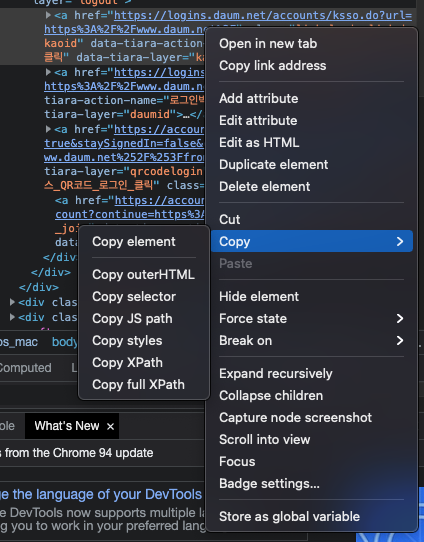
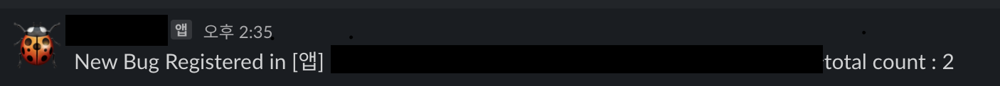

QA를 진행할떄 새로운 이슈가 올라오는 것을 확인하려면 

> 페이지 접속 > refresh > 이슈 개수가 늘어났는지 확인하기 

의 과정을 거쳐야하는데 .. 다른일하다가 리프레쉬 하기 귀찮아져서 crawler를 만들었다.


### 언어 선택 

nodejs와 cheerio를 이용해서 만들까 생각했는데 이 bug tracking 페이지의 문제는 로그인 과정이다.

> id, pw입력 > 휴대폰으로 인증번호 입력 > 로그인 

순으로 로그인이 이뤄지기 때문에 이미 띄워진 브라우저를 이용하거나 ,,, 아니면 인증번호 부분만 내가 입력하는 식으로 구현해야한다.
그래서 구글링하다 발견한게 python과 selenium을 이용한 방법인데 chromedriver를 이용해서 브라우저 창을 띄운 뒤에 element를 가져와서
내가 원하는 대로 클릭, 입력 이벤트를 수행할수 있어서 python으로 만들기로 했다. 

그래서 내가 만들 자동화 순서는 이렇게 된다. 
> 로그인 > 인증번호 수동입력 > bug수 체크 > sleep > 새로고침 > bug수 비교> 새로운 bug 출현시 slack message 보내기


### Chrome Driver Download

selenium에서 크롬브라우저를 띄울때 chrome driver를 이용하는데 본인의 크롬 버전과 같은 드라이버를 
[다운로드](https://sites.google.com/chromium.org/driver/downloads?authuser=0) 하면 된다. 

### Selenium

mac에는 기본적으로 python3이 깔려있는데, 그래서 dependency 추가할때 pip말고 pip3을 사용해야한다.  

```
pip3 install selenium
```

설치후 python 파일을 생성한다. 
python은 처음이기때문에 [python](https://wikidocs.net/book/2)에서 문법을 보면서 작성했다.
selenium의 기본 문법은 [이곳](https://greeksharifa.github.io/references/2020/10/30/python-selenium-usage/)을 참고해서 작성하였다. 


우선 브라우저를 열어야 하는데 이때 위에서 받은 driver의 경로를 알아야한다. 


```
import selenium
from selenium import webdriver

URL = 'url 주소'
driver = webdriver.Chrome('driver 경로')
driver.implicitly_wait(5)
driver.get(url=URL)

```

이렇게 하면 입력한 url을 호출한 브라우저창이 열린다. 
여기서 xpath로 element를 가져와서 id, pw 입력 후 로그인 버튼을 클릭해야한다. 
element는 크롬창에서 F12로 개발자 도구를 연 다음 원하는 element를 클릭하면 html tag가 나오는데 여기서 오른쪽마우스를 눌러서 
copy > copy full xpath를 클릭하면 xpath 경로를 얻을 수 있다. 



```
id_input = driver.find_element_by_xpath(
    '/html/body/div[1]/form/div/div[1]/input[1]')

```

이런식으로 원하는 element 값을 가져온 뒤에 send_key로 id 값을 입력한 후, 로그인 버튼을 클릭한다. 

```
id_input.send_keys('myid')
ActionChains(driver).click(login_btn).perform()
```

이제 수동으로 인증번호를 입력하고나면 로그인 완료된 화면으로 진입한다.
여기서 동일하게 element를 가져와서 개수 비교를 위해 새로고침을 하려는데 새로고침 후 element에 바로 접근하면, 페이지가 완전히 로드되지 않았을 경우 error가 발생한다.
그래서 암묵적 대기(implicitly_wait) 후 호출한다. 

```
driver.refresh
driver.implicitly_wait(time_to_wait=5)
after_cnt = total_cnt.text
```
근데 이렇게 하면 브라우저랑 연결이 끊긴다 .. 
error log는  
> selenium.common.exceptions.StaleElementReferenceException: Message: stale element reference: element is not attached to the page document

찾아보니 너무빨리 해서 그렇다는데 그래서 명시적 대기를 호출했는데도 똑같다
왜니 ? 정말. .. 

이 [블로그](https://study-grow.tistory.com/entry/%ED%81%AC%EB%A1%A4%EB%A7%81-%EA%B4%80%EB%A0%A8-selenium-stale-%EC%97%90%EB%9F%AC)에서는 sleep 을 하라는데 
sleep 해도 안된다 ^^....


이 [블로그](https://dockyum.tistory.com/48)에서는 element 객체를 재사용해서 그렇다고해서 
refresh이후에 element를 새로운 객체로 받아와서 시도하니 성공했다. 


### Slack Message 보내기 

새로운 버그가 올라오면 slack 메시지를 보내는 것이 이 자동화의 핵심이기 때문에 requests dependency를 추가한다. 

```
pip3 install requests
```

python에서 슬랙을 보내는 법은 [블로그](https://somjang.tistory.com/entry/Python-Slack-WebHooks-%EC%9D%84-%ED%86%B5%ED%95%B4-%EC%9E%91%EC%97%85-%EC%A7%84%ED%96%89%EC%83%81%ED%99%A9-%EC%95%8C%EB%A6%BC-%EB%B0%9B%EC%95%84%EB%B3%B4%EA%B8%B0-feat-Incoming-WebHooks)를 참조하였다.

간단하게는 webhook url과 text를 json 객체에 담아서 requests로 post 해주면 된다. 
그렇게 함수를 만들어서 call하면 끝

```
def send_message_to_slack(text):
    webhook_url = "https://hooks.slack.com/services/"
    payload = {"text": text}
    requests.post(webhook_url, json=payload)
```


### 실행 

그렇게 어쩌구저쩌구 만들어진 파일을 실행하려면 terminal에서 "python3 파일명" 을 입력하면된다.  

```
python3 main.py
```

완성된 full code는 
```
import selenium
from selenium import webdriver
from selenium.webdriver import ActionChains
from time import sleep
import requests


def send_message_to_slack(text):
    webhook_url = "https://hooks.slack.com/services/"
    prj_name = driver.find_element_by_xpath(
        '/html/body/div[1]/div[2]/div[3]/div/div/div[3]/div[1]/div[2]/table/tbody/tr/td[5]')
    payload = {"text": "New Bug Registered in " +
               prj_name.text + " total count : " + text}
    requests.post(webhook_url, json=payload)


URL = ''
driver = webdriver.Chrome('')
driver.implicitly_wait(5)
driver.get(url=URL)

id_input = driver.find_element_by_xpath(
    '/html/body/div[1]/form/div/div[1]/input[1]')
pw_input = driver.find_element_by_xpath(
    '/html/body/div[1]/form/div/div[1]/input[2]')
login_btn = driver.find_element_by_xpath(
    '/html/body/div[1]/form/div/div[1]/input[3]')

id_input.send_keys('')
pw_input.send_keys('')
ActionChains(driver).click(login_btn).perform()

sleep(60)


def check_if_new_bug_open():
    before_cnt = driver.find_element_by_xpath(
        '/html/body/div[1]/div[2]/div[3]/div/div/div[3]/div[1]/div[2]/table/tbody/tr/td[7]')

    print(before_cnt.text)
    before_cnt = before_cnt.text
    sleep(3)
    driver.refresh()
    sleep(5)

    total_cnt = driver.find_element_by_xpath(
        '/html/body/div[1]/div[2]/div[3]/div/div/div[3]/div[1]/div[2]/table/tbody/tr/td[7]')
    # WebDriverWait(driver, 30).until(EC.presence_of_element_located(
    #     (By.XPATH, '/html/body/div[1]/div[2]/div[3]/div/div/div[3]/div[1]/div[2]/table/tbody/tr/td[7]')))
    after_cnt = total_cnt.text
    try:
        if before_cnt < after_cnt:
            send_message_to_slack(after_cnt)
    except:
        print('error')


while True:
    check_if_new_bug_open()

```

그럼 무한루프로 실행되면서 slack으로 알림이 온다 👍🏻
