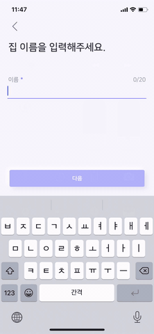

## Introduction 

모바일 앱을 만들다 보면 회원 가입과 같이 순서대로 값을 입력해야 하는 경우가 생긴다.

기존에 JAVA로 코드를 작성할 때는 입력값을 입력하고 다음 입력값을 입력하도록 커서를 이동시킬 때, 메소드가 끝나면 다음 동작을 수행할 메소드를 콜하는 방식으로 UI를 구현해 왔습니다.

하지만, Kotlin으로 코드를 작성하면서 getter 와 setter를 이용하여 좀 더 readable한 코드를 작성할 수 있게 되었고, 이를 정리해보고자 합니다. 또한, 같은 방식으로 Swift 코드를 작성하여 이도 함께 정리합니다.


## What to make 😎




## How to - Kotlin📱

Kotlin에서는 Swift와 같이 변수에 custom getter, setter를 설정할 수 있습니다.

이를 이용해서 UI의 순서대로 배열을 생성하고, 다음 스텝으로 넘어갈때, 배열에서 이미 수행된 값을 제거하면 변수의 값이 바뀌면서 미리 지정한 다음 순서의 method를 call하는 방식으로 UI를 그려나갑니다.

```kotlin
var <propertyName>: <PropertyType> [= <property_initializer>]
    [<getter>]
    [<setter>]
```


먼저 Readable한 코드를 위해 상수값을 선언합니다.

```kotlin
const val SHOW_TYPE = 101
const val SHOW_MONEY = 102
const val SHOW_DATE = 103
const val SHOW_PHOTO = 104
```

그 후 이 상수들을 화면에서 보여줄 순서대로 배열에 담습니다.

이렇게 정의해 두면 먼저 타입을 보여주고 돈을 입력하고 날짜를 입력한 뒤 사진을 보여주는 순서대로 UI가 흘러간다는 것을 알기가 쉽습니다. 후에 코드를 수정하거나 순서가 변경되었을때에도 유지보수가 편리합니다.

```kotlin
private val showUISequence = mutableListOf(
        SHOW_TYPE,
        SHOW_MONEY,
        SHOW_DATE,
        SHOW_PHOTO
    )
```

이제 앞에서 설명했던 변수를 하나 선언하고, getter 와 setter를 정의합니다.

저는 setter만 정의하였습니다. 변수의 값이 바뀌면 그 값에 따라 method를 콜하는 방식으로 이루어져있습니다.

```kotlin
 private var uiStep: Int = 0
        set(nextStep) {
            field = nextStep
            when (nextStep) {
                SHOW_TYPE -> {
                    showType()
                }
                SHOW_MONEY -> {
                    showMoney()
                }
                SHOW_DATE -> {
                    showDate()
                }
                SHOW_PHOTO -> {
                    showPhoto()
                }
            }
        }
```


마지막으로 uiStep의 값을 변경하는 함수를 정의합니다.

showUISequence 배열의 값이 비어있지 않으면 변수 uiStep의 값은 showUISequence배열의 첫번째 값을 제거한 값이 됩니다. 따라서 맨 처음 값이 uiStep의 값이 되고 uiStep은 값이 변하였기 때문에 다음 method를 call합니다.

```kotlin
 private fun nextStepTrigger() {
        if (showUISequence.isNotEmpty()) {
            uiStep = showUISequence.removeAt(0)
        }
    }
```


## How to - Swift📱

Swift에도 변수에 getter와 setter를 정의하는 기능이 있습니다.

Kotlin과 같이 먼저 상수를 선언하는데 여기서는 enum class를 사용하였습니다.

```swift
 enum uiSequence {
        case showType, showMoney, showDate, showPhoto
        var type: Int{
            switch self {
            case .showType: return 101
            case .showMoney: return 102
            case .showDate: return 103
            case .showPhoto: return 104
            }
        }
    }
```

그 다음 이것들을 배열에 담고

```swift
private var showUISequence: Array<Int> = [
        uiSequence.showType.type,
        uiSequence.showMoney.type,
        uiSequence.showDate.type,
        uiSequence.showPhoto.type
    ]
```

값이 변하면서 method를 call해줄 변수를 선언합니다.

```swift
 var _uiStep: Int = 0
    var uiStep: Int{
        get{
            return _uiStep
        }
        set(nextStep){
            _uiStep = nextStep
            switch nextStep {
            case uiSequence.showType.type:
                showType()
            case uiSequence.showMoney.type:
                showMoney()
            default:
                showType()
            }
        }
    }
```

마지막으로 변수의 값을 바꿔주는 method를 작성합니다.

```swift
func nextStepTrigger(){
        if !showUISequence.isEmpty {
            uiStep = showUISequence.remove(at: 0)
        }
    }
```


## Conclusion🎉

생각보다 간단한 방법이지만 이러한 기본 기능을 잘 사용하여 읽기 쉬운 코드를 작성하고, 유지보수가 쉬운 코드를 작성할 수 있다는 점을 알게 되어 간단히 정리하였습니다. 다른 좋은 방법을 찾게 된다면 또 정리해보도록 하겠습니다.
